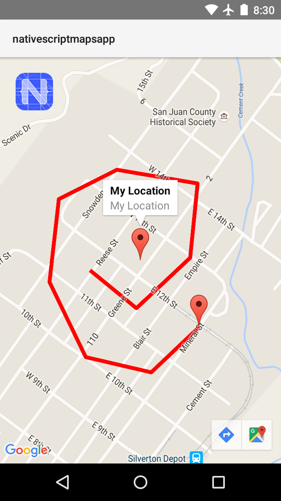
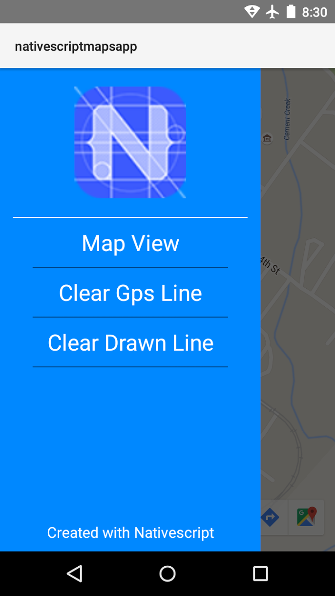

# nativescript-maps-app
Simple Nativescript + Angular 2 + Typescript App

This project demonstrates how to use Nativescript with Angular 2 and Typescript, along with the Google Maps API natively.




## Quick Start
Pull down the project.

Register for a Google Maps API key in the [Google Developers Console](https://console.developers.google.com).

For Android, add the key to `app/App_Resources/Android/values/nativescript_google_maps_api.xml`.
For IOS, add the key to `app/app.component.ts`.

Run the appropriate command(s) from the terminal in the project folder
```
tns platform add ios
tns run ios
```
```
tns platform add android
tns run android
```
### iOS Note
I haven't yet successfully built this for iOS.  There is an issue installing the cocoapod for Google Maps.  The solution below has fixed it for others but not me.  If you are aware of a solution, please let me know and I'll update the project!
```
sudo gem install cocoapods
cd platforms/ios
pod install
``` 
More info here: [Google Maps iOS SDK](https://developers.google.com/maps/documentation/ios-sdk/start)

## Features
1. Google Maps natively integrated.
2. Geolocation draws your path on the map as you travel.
3. Draw a route by touching points on the map.
4. Includes Telerik-UI side drawer.
5. Nativescript + Angular2 + Typescript

### Notes
- I have only compiled this on Android so far.


Special thanks to  [dapriett](https://github.com/dapriett) and  [Telerik](http://nativescript.org/)